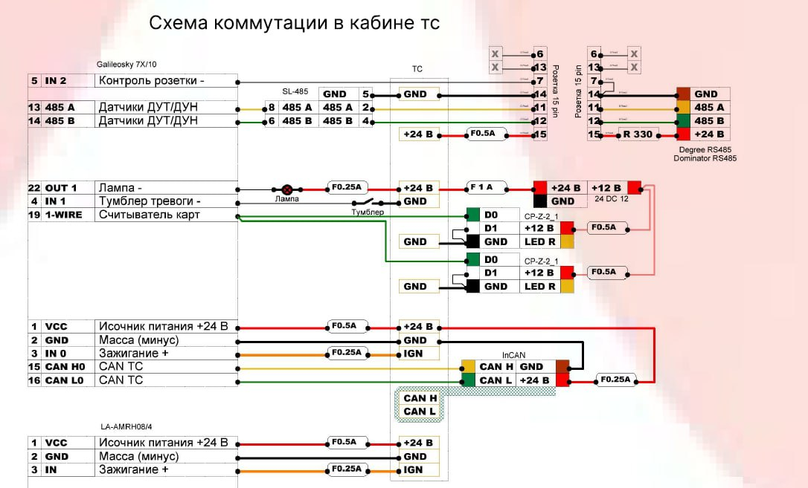
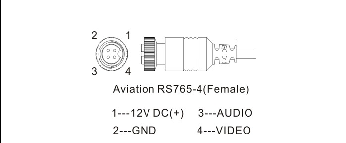
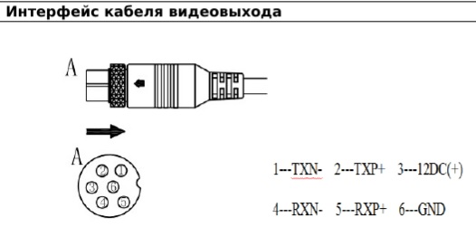
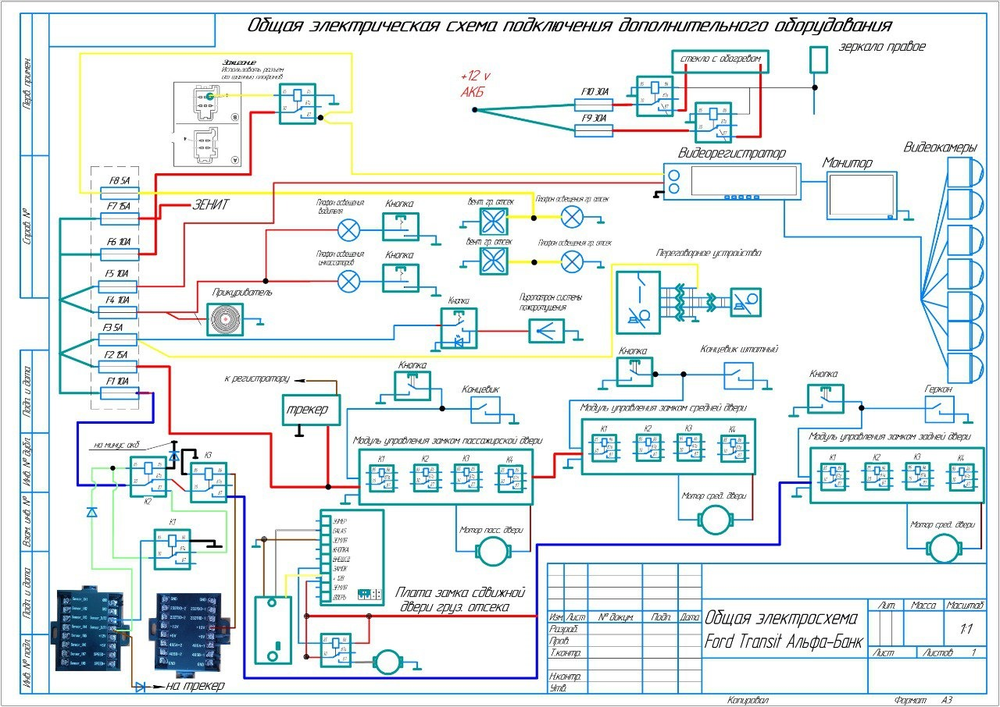

## Распиновки

**La6PIN+rj45**

**Схема коммутации в кабине ТС**

**Распиновка DB-26**

**Распиновка AHD КАМЕРЫ**

**Распиновка 6 pin**

## Блок-схемы

### Тепловозы

**ТЭМ18** [скачать](instructions/files/schemes/tem18.pdf ":ignore")

**УТРЗ.Тэм9** [скачать](instructions/files/schemes/УТРЗ.Тэм9.pdf ":ignore")

**Тепловоз ВПТ** [скачать](instructions/files/schemes/Тепловоз_ВПТ.pdf ":ignore")

**ТГМ-6** [скачать](instructions/files/schemes/ТГМ-6.pdf ":ignore")

**Монтаж Электровоза ЕЛ21** [скачать](instructions/files/schemes/Монтаж_Электровоза_ЕЛ21.pdf ":ignore")

### Прочее

**Схема Альфа**

**Схема Граз(Маз)**

.jpg>)

**СЭП Тягач**

## Схемы комплексов

**Питерские автономки** [скачать](instructions/files/schemes/Питерские_автономки.pdf ":ignore")

**Схема подключения тумблеров локомотив** [скачать](instructions/files/schemes/Схема_подключения_тумблеров_локомотив.pdf ":ignore")

**Тягач плюс бочка** [скачать](instructions/files/schemes/Тягач_плюс_бочка.pdf ":ignore")
