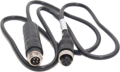

# Кабели

**Материал** | **Экранирование** | **Материал жил** | **Тип соединения** | **Класс защиты** | **Длина** 
 --- | --- | --- | --- | --- | --- 
 ПВХ | фольгирование | многожильная медь | 4-pin avia | IP67 | 1, 5 м

 ## 1 м

* [LA-4Pin 01.pdf](https://drive.google.com/file/d/1rhesgDe0C8iJX_SMhFtC2Rzaj5MJnNBT/view?usp=drive_link) 

* [LA-4Pin 01.doc](https://docs.google.com/document/d/1ZM64jFdKDgQ46TaoBuikOBX-TkMYLYXv/edit?usp=drive_link&ouid=108748645944006776128&rtpof=true&sd=true)

* [LA-4Pin01 scheme.pdf](https://drive.google.com/file/d/1P5hFSonhE4_KuNY4n1z3Xd1yu40p3uFQ/view?usp=drive_link)

* [LA-4Pin 01 passport with scheme.docx](https://docs.google.com/document/d/1g7T4YhN9tBMHD8BHjEGQh-COSCKO4Ft5/edit?usp=drive_link&ouid=108748645944006776128&rtpof=true&sd=true)

* [LA-4Pin 01 passport with scheme.pdf](https://drive.google.com/file/d/1bu43TkSX29ewpNzSHIocQF_fb-zGCcct/view?usp=drive_link)

## 5 м

* [LA-4Pin 05.pdf](https://drive.google.com/file/d/1w4a1RIg2Rn4x4GBdAKBAmNp1CqpIufvo/view?usp=drive_link) 

* [LA-4Pin 05.doc](https://docs.google.com/document/d/1xgV8qW7IY_v_2H3gt4-tarK6jksIg_Z4/edit?usp=drive_link&ouid=108748645944006776128&rtpof=true&sd=true) 