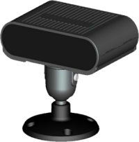
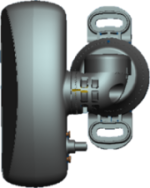

# Камеры аналитики водителя

>Таблица соответствия старой и новой номенклатур

**Старое наименование** | **Новое наименование**
--- | ---
LA-ALine | LA-DMS-IP (в большом корпусе)
LA-ALineC | LA-DMS-IP-G1 (в маленьком корпусе)
LA-LineC | LA-DMS-AH (аналоговая)

## Старая номенклатура

### *LA-ALine*

* [LA-ALine.docx](passports\Несогласованные\Камеры_аналитики_водителя\Старые_названия\LA-ALine.docx ':ignore')

* [LA-ALine.pdf](passports\Несогласованные\Камеры_аналитики_водителя\Старые_названия\LA-ALine.pdf ':ignore')

### *LA-ALineC*

* [LA-ALineC.docx](passports\Несогласованные\Камеры_аналитики_водителя\Старые_названия\LA-ALineC.docx ':ignore')

* [LA-ALineC.pdf](passports\Несогласованные\Камеры_аналитики_водителя\Старые_названия\LA-ALineC.pdf ':ignore')

### *LA-LineC*

* [LA-LineC.docx](passports\Несогласованные\Камеры_аналитики_водителя\Старые_названия\LA-LineC.docx ':ignore')

* [LA-LineC.pdf](passports\Несогласованные\Камеры_аналитики_водителя\Старые_названия\LA-LineC.pdf ':ignore')

## Новая номенклатура

### *LA-DMS-IPG1*

* [LA-IDMS-G1.docx](passports\Несогласованные\Камеры_аналитики_водителя\Новые_названия\LA-IDMS-G1.docx ':ignore')

* [LA-IDMS-G1.pdf](passports\Несогласованные\Камеры_аналитики_водителя\Новые_названия\LA-IDMS-G1.pdf ':ignore')

### *LA-DMS-IPG2*

* [LA-IDMS-G2.docx](passports\Несогласованные\Камеры_аналитики_водителя\Новые_названия\LA-IDMS-G2.docx ':ignore')

* [LA-IDMS-G2.pdf](passports\Несогласованные\Камеры_аналитики_водителя\Новые_названия\LA-IDMS-G2.pdf ':ignore')

### *LA-DMS-AHD*

* [LA-ADMS.docx](passports\Несогласованные\Камеры_аналитики_водителя\Новые_названия\LA-ADMS.docx ':ignore')

* [LA-ADMS.pdf](passports\Несогласованные\Камеры_аналитики_водителя\Новые_названия\LA-ADMS.pdf ':ignore')