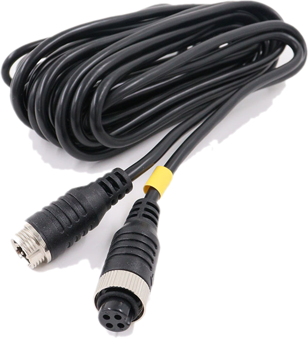
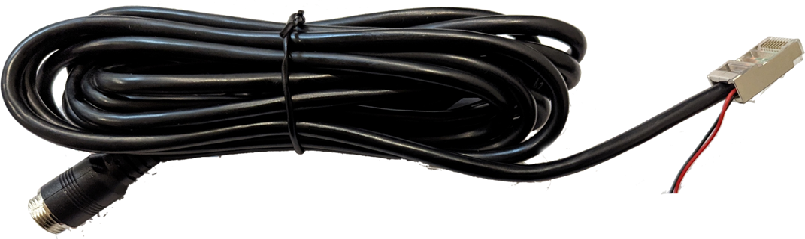
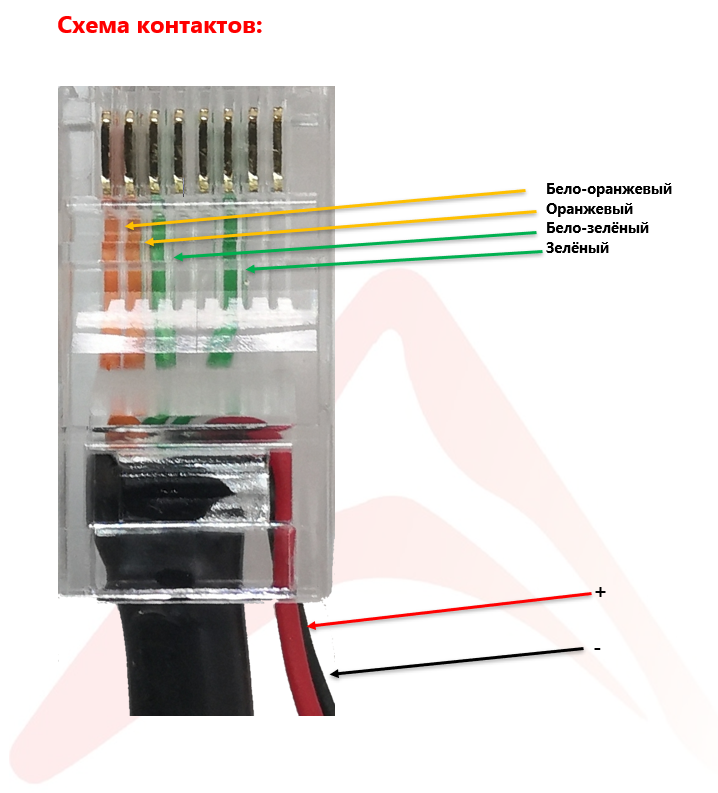

# Технические описания для кабелей

## 4-pin avia

**Кабель соединительный LA-4Pin**

**Основные особенности:**

- **Экранированный**
- **Многожильная медь**
- **Класс защиты IP67**
- **Влагозащитный кожух**

---

| **Категория**         | **Характеристика**                |
| --------------------- | --------------------------------- |
| **Сторона А**         | Разъём авиационный 4-pin (female) |
| **Сторона Б**         | Разъём авиационный 4-pin (male)   |
| **Материал оболочки** | ПВХ                               |
| **Экранирование**     | Есть, фольга                      |
| **Длина**             | 1 м / 5 м / 10 м / 15 м / 20 м    |
| **Материал жил**      | Многожильная медь                 |
| **Тип соединителя**   | GX16                              |
| **Класс защиты**      | IP67                              |
| **Цвет**              | Чёрный                            |

**Скачать паспорт** [LA-4Pin.pdf](passports/files/LA-4Pin.pdf ":ignore")

## 6-pin avia

**Кабель соединительный LA-6Pin RJ45**

**Основные особенности:**

- **Экранированный**
- **Многожильная медь**
- **Класс защиты IP67**

---

| **Категория**         | **Характеристика**                 |
| --------------------- | ---------------------------------- |
| **Сторона А**         | RJ45S (male) экранированный 4 жилы |
| **Питание**           | (две жилы: чёрный -, красный +)    |
| **Сторона Б**         | Разъём авиационный 6-pin (male)    |
| **Материал оболочки** | ПВХ                                |
| **Экранирование**     | Есть, фольга                       |
| **Длина**             | 5 м                                |
| **Материал жил**      | Многожильная медь                  |
| **Класс защиты**      | IP67                               |
| **Цвет**              | Чёрный                             |

**Скачать паспорт** [LA-6Pin RJ45.pdf](passports/files/LA-6Pin-RJ45.pdf ":ignore")

