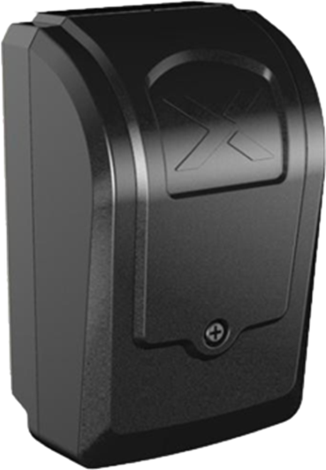

# Паспорта оборудования для камер видеонаблюдения

## Камеры аналитики водителя

### LA-DMS-AH

**Камера контроля состояния водителя LA-DMS-AH**

**Основные особенности:**

- **Поддержка разрешения 1280 × 720**
- **Поддерживает локализацию интеллектуального алгоритма DMS**
- **Поддерживает экспозицию центральной области лица**
- **Регулируемая ИК подсветка**

**Функции активной безопасности:**

Профессиональная DMS-система (Driver Monitoring System – контроль состояния водителя) со встроенным искусственным интеллектом осуществляет мониторинг состояния водителя. Детектирует:

- Разговор по телефону
- Непристёгнутый ремень безопасности
- Усталость
- Курение
- Отвлечение

При регистрации события система подаёт **звуковой и визуальный сигнал** через дисплей-оповещатель, чтобы в режиме реального времени предупредить водителя. В то же время записи событий могут быть выгружены на сервер (в зависимости от настроек и комплектации видеорегистратора).

---

| Категория                    | Характеристика                                                  |
| ---------------------------- | --------------------------------------------------------------- |
| **Видео**                    |                                                                 |
| Матрица                      | 1/3’’ 1.3 MP CMOS                                               |
| Разрешение                   | 1280 × 720                                                      |
| Затвор                       | 1/30 с – 1/5000 с                                               |
| Видеосигнал                  | PAL / NTSC                                                      |
| Минимальная освещённость     | 0.1 Лк                                                          |
| Отношение сигнал/шум         | ≥48 дБ                                                          |
| Угол обзора                  | H: 65° / V: 41°                                                 |
| Соотношение сторон           | 16:9                                                            |
| Объектив                     | 3–6 мм, тип M12, фиксированная диафрагма                        |
| Фокусное расстояние          | 3 мм                                                            |
| Диафрагма                    | F1.6                                                            |
| Режим экспозиции             | Автоматический                                                  |
| Дневной/ночной режим         | Чёрно-белый (по умолчанию)                                      |
| Шумоподавление               | Поддерживается                                                  |
| **ИК-подсветка**             |                                                                 |
| Тип подсветки                | 2 ИК светодиода 940 нм с точечной матрицей                      |
| Дальность действия           | До 1,1 м                                                        |
| **Интерфейсы**               |                                                                 |
| Видеовыход                   | 4 pin                                                           |
| Просмотр                     | Зависит от типа видеорегистратора                               |
| **Питание**                  |                                                                 |
| Источник питания             | 12 В ±10% DC, бортовое питание автомобиля                       |
| Потребляемая мощность        | < 5 Вт (с включённой ИК подсветкой)                             |
| **Физические параметры**     |                                                                 |
| Размеры                      | 98 × 30 × 43 мм (Д × Ш × В)                                     |
| Монтаж                       | Боковая стойка, лобовое стекло, вертикально на приборную панель |
| **Эксплуатационные условия** |                                                                 |
| Температурный режим          | от -40°C до +70°C                                               |
| Класс защиты                 | IP53                                                            |

**Скачать паспорт** [LA-DMS-AH.pdf](passports/files/LA-DMS-AH.pdf ":ignore")

### LA-DMS-IP

**Камера контроля состояния водителя LA-DMS-IP**

**Основные особенности:**

- **Поддержка разрешения 1280 × 800 @ 20fps**
- **Поддерживает локализацию интеллектуального алгоритма DSM**
- **Поддерживает экспозицию центральной области лица**
- **Регулируемая ИК подсветка**
- **Встроенный микрофон**
- **Встроенный G-сенсор**

**Функции активной безопасности:**

Профессиональная IP DMS-камера (Driver Monitoring System – контроль состояния водителя) со встроенным искусственным интеллектом осуществляет мониторинг состояния водителя. Детектирует:

- Разговор по телефону
- Непристёгнутый ремень безопасности
- Усталость
- Курение
- Отвлечение

При регистрации события система подаёт **звуковой и визуальный сигнал** через дисплей-оповещатель, чтобы в режиме реального времени предупредить водителя. Записи событий могут быть выгружены на сервер (в зависимости от настроек и комплектации видеорегистратора).

---

| Категория                    | Характеристика                                                  |
| ---------------------------- | --------------------------------------------------------------- |
| **Видео**                    |                                                                 |
| Матрица                      | 1/4’’ 2 MP CMOS                                                 |
| Разрешение                   | 1280 × 800 @ 20 к/с                                             |
| Затвор                       | 1/30 с – 1/5000 с                                               |
| Видеокодек                   | H.264 / H.265                                                   |
| Минимальная освещённость     | 0.1 Лк                                                          |
| Отношение сигнал/шум         | ≥48 дБ                                                          |
| Угол обзора                  | H: 76° / V: 44°                                                 |
| Соотношение сторон           | 16:10                                                           |
| Объектив                     | 3–6 мм, тип M12, фиксированная диафрагма                        |
| Фокусное расстояние          | 3 мм                                                            |
| Диафрагма                    | F1.6                                                            |
| Режим экспозиции             | Автоматический                                                  |
| Дневной/ночной режим         | Чёрно-белый (по умолчанию)                                      |
| Шумоподавление               | Поддерживается                                                  |
| **ИК-подсветка**             |                                                                 |
| Тип подсветки                | 2 ИК светодиода 940 нм с точечной матрицей                      |
| Дальность действия           | До 1,1 м                                                        |
| **Аудио**                    |                                                                 |
| Устройства                   | Встроенный микрофон                                             |
| **Сенсоры**                  |                                                                 |
| G-сенсор                     | Встроенный                                                      |
| **Интерфейсы**               |                                                                 |
| Видеовыход                   | 6 pin                                                           |
| Просмотр                     | Встроенный WEB-интерфейс, доступ через браузер IE               |
| **Питание**                  |                                                                 |
| Источник питания             | 9–18 В DC, бортовое питание автомобиля                          |
| Потребляемая мощность        | < 5 Вт (с включённой ИК подсветкой)                             |
| **Физические параметры**     |                                                                 |
| Размеры                      | 105 × 57 × 89 мм (Д × Ш × В)                                    |
| Монтаж                       | Боковая стойка, лобовое стекло, вертикально на приборную панель |
| **Эксплуатационные условия** |                                                                 |
| Температурный режим          | от -40°C до +70°C                                               |
| Класс защиты                 | IP53                                                            |

**Скачать паспорт** [LA-DMS-IP.pdf](passports/files/LA-DMS-IP.pdf ":ignore")

### LA-DMS-IP-G1

**Камера контроля состояния водителя LA-DMS-IP-G1**

**Основные особенности:**

- **Поддержка разрешения 1280 × 720**
- **Поддерживает локализацию интеллектуального алгоритма DMS**
- **Поддерживает экспозицию центральной области лица**
- **Регулируемая ИК подсветка**

**Функции активной безопасности:**

Профессиональная IP DMS-система (Driver Monitoring System – контроль состояния водителя) со встроенным искусственным интеллектом осуществляет мониторинг состояния водителя. Детектирует:

- Разговор по телефону
- Непристёгнутый ремень безопасности
- Усталость
- Курение
- Отвлечение

При регистрации события система подаёт **звуковой и визуальный сигнал** через дисплей-оповещатель, чтобы в режиме реального времени предупредить водителя. Записи событий могут быть выгружены на сервер (в зависимости от настроек и комплектации видеорегистратора).

---

| Категория                    | Характеристика                                                  |
| ---------------------------- | --------------------------------------------------------------- |
| **Видео**                    |                                                                 |
| Матрица                      | 1/3’’ 1.3 MP CMOS                                               |
| Разрешение                   | 1280 × 720                                                      |
| Затвор                       | 1/30 с – 1/5000 с                                               |
| Система видеосигнала         | PAL / NTSC                                                      |
| Минимальная освещённость     | 0.1 Лк                                                          |
| Отношение сигнал/шум         | ≥48 дБ                                                          |
| Угол обзора                  | H: 65° / V: 41°                                                 |
| Соотношение сторон           | 16:9                                                            |
| Объектив                     | 3–6 мм, тип M12, фиксированная диафрагма                        |
| Фокусное расстояние          | 3 мм                                                            |
| Диафрагма                    | F1.6                                                            |
| Режим экспозиции             | Автоматический                                                  |
| Дневной/ночной режим         | Чёрно-белый (по умолчанию)                                      |
| Шумоподавление               | Поддерживается                                                  |
| **ИК-подсветка**             |                                                                 |
| Тип подсветки                | 2 ИК светодиода 940 нм с точечной матрицей                      |
| Дальность действия           | До 1,1 м                                                        |
| **Интерфейсы**               |                                                                 |
| Видеовыход                   | 6 pin                                                           |
| Просмотр                     | Зависит от типа видеорегистратора                               |
| **Питание**                  |                                                                 |
| Источник питания             | 12 В ±10% DC, бортовое питание автомобиля                       |
| Потребляемая мощность        | < 5 Вт (с включённой ИК подсветкой)                             |
| **Физические параметры**     |                                                                 |
| Размеры                      | 98 × 30 × 43 мм (Д × Ш × В)                                     |
| Монтаж                       | Боковая стойка, лобовое стекло, вертикально на приборную панель |
| **Эксплуатационные условия** |                                                                 |
| Температурный режим          | от -40°C до +70°C                                               |
| Класс защиты                 | IP53                                                            |

**Скачать паспорт** [LA-DMS-IP-G1.pdf](passports/files/LA-DMS-IP-G1.pdf)

## Камеры курсовые

### LA-CRS

**Курсовая камера LA-CRS**

**Основные особенности:**

- **Поддержка разрешения 1920 × 1080**
- **Различимая картинка при минимальной освещённости 0.05 Лк**
- **Матрица CMOS 1/2.8’’ 2.13 Мп**
- **Поддержка бесступенчатой регулировки угла наклона**
- **Простая и удобная установка камеры на лобовое стекло. Изображение без бликов и отражений**

---

| Категория                    | Характеристика                             |
| ---------------------------- | ------------------------------------------ |
| **Видео**                    |                                            |
| Матрица                      | 1/2.8” 2.13 Mp SONY Starvis IMX307LQD CMOS |
| Разрешение                   | 1920 × 1080                                |
| Затвор                       | 1/50 с – 1/100000 с (авто)                 |
| Система видеосигнала         | NTSC / PAL                                 |
| Система синхронизации        | Внутренняя                                 |
| Система сканирования         | Прогрессивная                              |
| Минимальная освещённость     | 0.05 Лк                                    |
| Отношение сигнал/шум         | ≥45 дБ                                     |
| Угол обзора                  | H: 42° / V: 23°                            |
| Объектив                     | Тип М12, фиксированная диафрагма           |
| Фокусное расстояние          | 6 мм                                       |
| Соотношение сторон           | 16:9                                       |
| Дневной/ночной режим         | Полноцветный (без ИК)                      |
| Шумоподавление               | Поддерживается                             |
| Компенсация засветки         | Поддерживается                             |
| Режим экспозиции             | Автоматический                             |
| Баланс белого                | Автоматический                             |
| Гамма-коррекция              | 0.6                                        |
| **Интерфейсы**               |                                            |
| Видеовыход                   | RS765 4 pin                                |
| **Питание**                  |                                            |
| Источник питания             | 12 В ± 10% постоянного тока                |
| Энергопотребление            | 90 мА / 12 В ± 5% постоянного тока         |
| Потребляемая мощность        | Менее 1.5 Вт                               |
| **Физические параметры**     |                                            |
| Размеры                      | 110 × 75 × 54 мм (Д × Ш × В)               |
| Масса (нетто)                | 100 г                                      |
| **Эксплуатационные условия** |                                            |
| Рабочая температура          | от -40°C до +70°C                          |
| Степень защиты               | IP53                                       |
| **Способ установки**         | На лобовом стекле                          |

**Скачать паспорт** [LA-CRS.pdf](passports/files/LA-CRS.pdf ":ignore")

### LA-CRS-X

**Курсовая камера с системой помощи водителю LA-CRS-X**

**Основные особенности:**

- **Поддержка разрешения 1920 × 1080**
- **Различимая картинка при минимальной освещённости 0.05 Лк**
- **Матрица CMOS 1/2.8’’ 2.13 Мп**
- **Поддержка бесступенчатой регулировки угла наклона**
- **Простая и удобная установка камеры на лобовое стекло. Изображение без бликов и отражений**
- **Поддерживает двунаправленную функцию UTC и используется с интеллектуальным видеорегистратором**

---

**Функции активной безопасности:**

Профессиональная курсовая ADAS камера (Advanced Driver Assistance Systems – усовершенствованная система помощи водителю) оснащена алгоритмами для обеспечения безопасности вождения. Камера позволяет регистрировать события и подавать звуковой и визуальный сигнал через панель индикации тревог **LA-RWT** для предупреждения водителя в реальном времени. Записи событий могут быть выгружены на сервер, в зависимости от настроек и комплектации видеорегистратора.

---

| Категория                    | Характеристика                     |
| ---------------------------- | ---------------------------------- |
| **Видео**                    |                                    |
| Матрица                      | 1/2.8” 2.13 Mp CMOS                |
| Разрешение                   | 1920 × 1080                        |
| Затвор                       | 1/25 с – 1/25000 с (авто)          |
| Система видеосигнала         | NTSC / PAL                         |
| Система синхронизации        | Внутренняя                         |
| Система сканирования         | Прогрессивная                      |
| Минимальная освещённость     | 0.05 Лк                            |
| Отношение сигнал/шум         | ≥50 дБ                             |
| Угол обзора                  | H: 42° / V: 23°                    |
| Объектив                     | Тип М12, фиксированная диафрагма   |
| Фокусное расстояние          | 4 мм                               |
| Соотношение сторон           | 16:9                               |
| Дневной/ночной режим         | Полноцветный (без ИК)              |
| Шумоподавление               | Поддерживается                     |
| Компенсация засветки         | Поддерживается                     |
| Режим экспозиции             | Автоматический                     |
| Баланс белого                | Автоматический                     |
| Гамма-коррекция              | 0.6                                |
| **Интерфейсы**               |                                    |
| Видеовыход                   | RS765 4 pin                        |
| **Интерфейсы и питание**     |                                    |
| Источник питания             | 12 В ± 10% постоянного тока        |
| Энергопотребление            | 80 мА / 12 В ± 5% постоянного тока |
| **Физические параметры**     |                                    |
| Размеры                      | 87 × 55 × 39 мм (Д × Ш × В)        |
| Масса (нетто)                | 100 г                              |
| **Эксплуатационные условия** |                                    |
| Рабочая температура          | от -40°C до +70°C                  |
| Степень защиты               | IP53                               |
| **Способ установки**         | На лобовом стекле                  |

**Скачать паспорт** [LA-CRS-X.pdf](passports/files/LA-CRS-X.pdf ":ignore")

## Камеры универсальные

### LA-CAM-DAH

**Видеокамера LA-CAM-DAH**

**Основные особенности:**

- **Компактный корпус**
- **Полимерное лакокрасочное покрытие**
- **Виброустойчивый авиационный разъём**
- **Высокий диапазон рабочих температур**
- **Механический ИК-фильтр**
- **Аппаратный WDR**
- **Совместима со всеми регистраторами марки LA**

---

| **Категория**           | **Характеристика** |
| ----------------------- | ------------------ |
| **Тип камеры**          | AHD                |
| **Матрица**             | Sony 1/2.8’’ 2Mp   |
| **Разрешение**          | 1080P (960H, 720P) |
| **Угол обзора**         | 105°               |
| **Чувствительность**    | 0.01 Лк            |
| **Фокусное расстояние** | 2,8 мм или 3,6 мм  |
| **ИК-подсветка**        | До 12 м            |
| **Выход**               | 4 pin              |
| **Габариты (мм)**       | Ø 60 x 60 x 50     |
| **Тип корпуса**         | Антивандальный     |
| **Класс защиты**        | IP67               |
| **Рабочая температура** | от -40°C до +70°C  |
| **Рабочее напряжение**  | 12 В               |

**Скачать паспорт** [LA-CAM-DAH.pdf](passports/files/LA-CAM-DAH_with_schema.pdf ":ignore")

### LA-CAM-DIP

**ПАСПОРТ Видеокамера LA-CAM-DIP**

**Основные особенности:**

- **Компактный корпус**
- **Полимерное лакокрасочное покрытие**
- **Виброустойчивый авиационный разъём**
- **Высокий диапазон рабочих температур**
- **Механический ИК-фильтр**
- **Аппаратный WDR**
- **Совместима со всеми регистраторами марки LA**

---

| **Категория**           | **Характеристика**        |
| ----------------------- | ------------------------- |
| **Тип камеры**          | IP                        |
| **Матрица**             | Sony 1/3’’ 2Mp            |
| **Разрешение**          | 1080P (960H, 720P)        |
| **Угол обзора**         | 105°                      |
| **Чувствительность**    | 0.01 Лк                   |
| **Фокусное расстояние** | 2,8 мм, 3,6 мм или 8,0 мм |
| **ИК-подсветка**        | До 12 м                   |
| **Габариты (мм)**       | Ø 60 x 60 x 50            |
| **Тип корпуса**         | Антивандальный            |
| **Класс защиты**        | IP67                      |
| **Рабочая температура** | от -40°C до +70°C         |
| **Рабочее напряжение**  | 12 В                      |

**Скачать паспорт** [LA-CAM-DIP.pdf](passports/files/LA-CAM-DIP_with_schema.pdf ":ignore")

---
