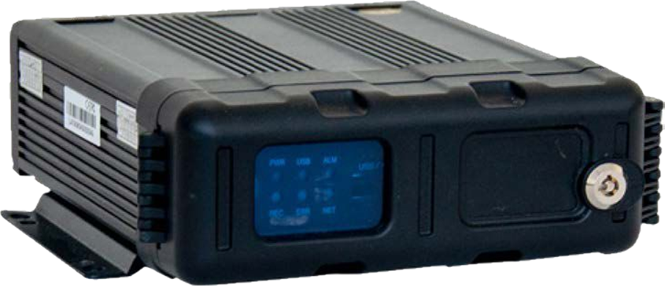
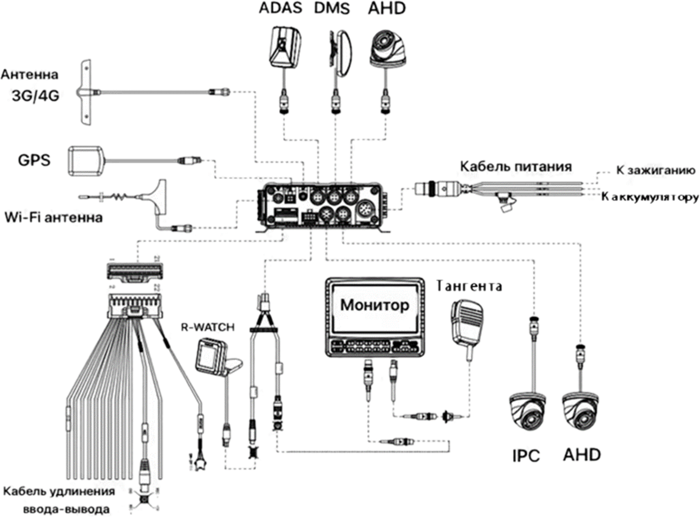
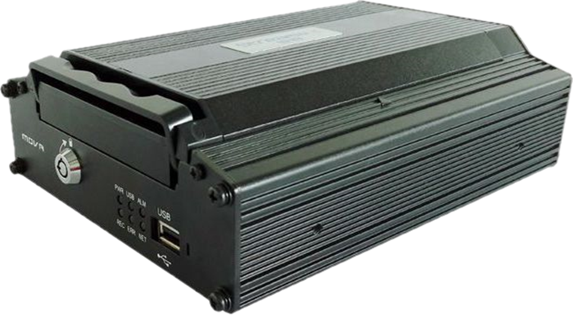
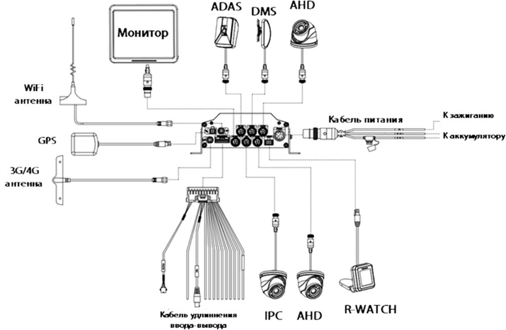
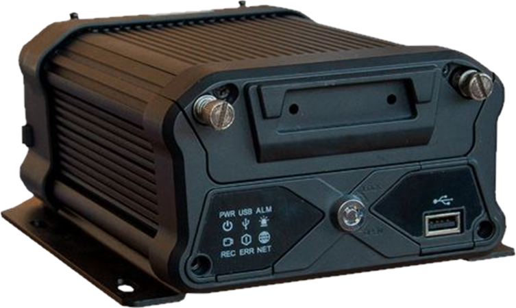
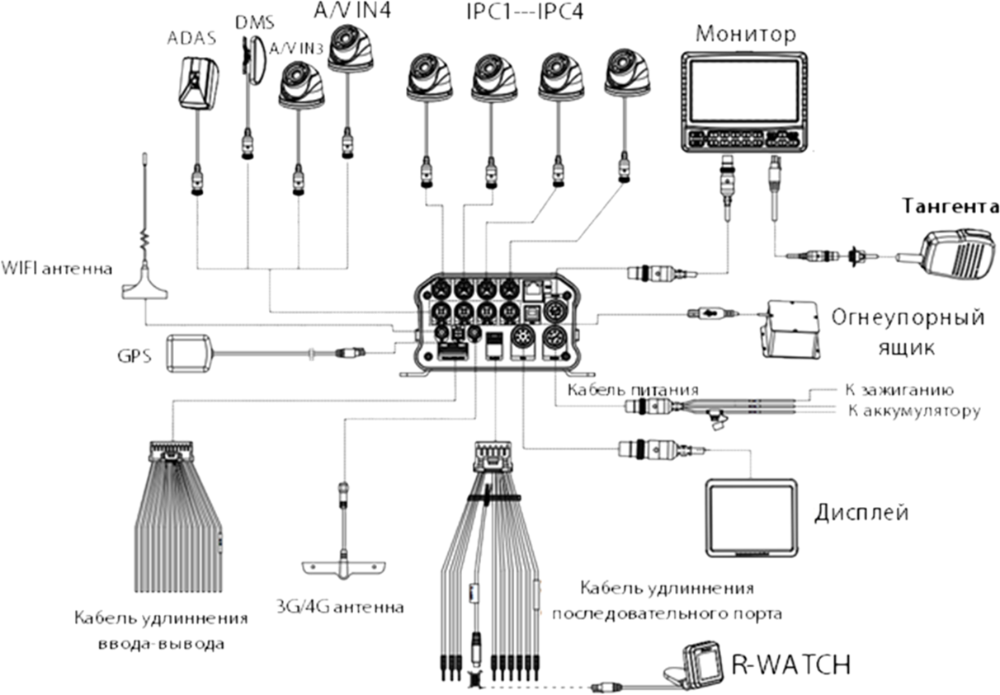
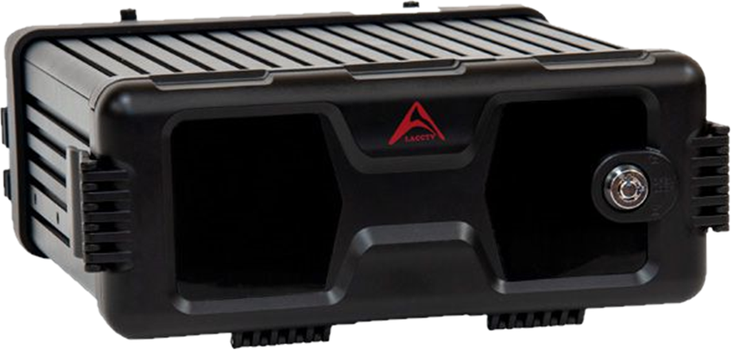
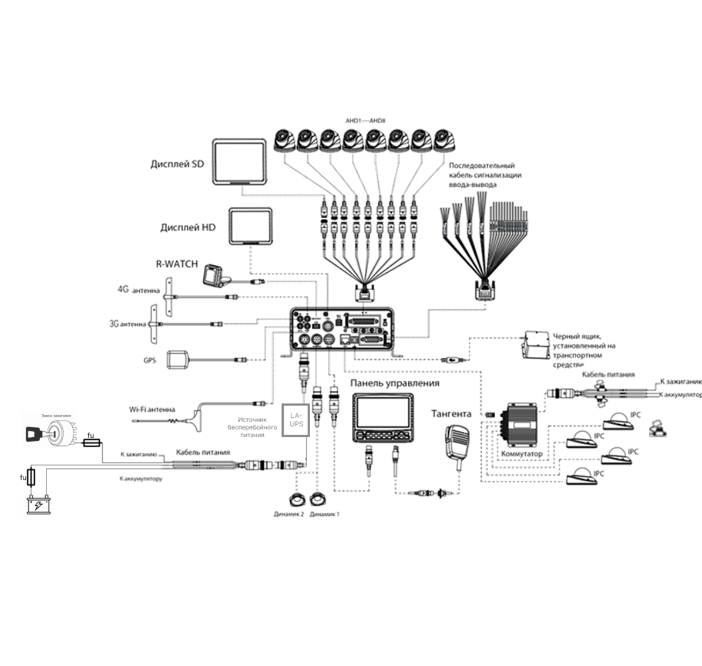
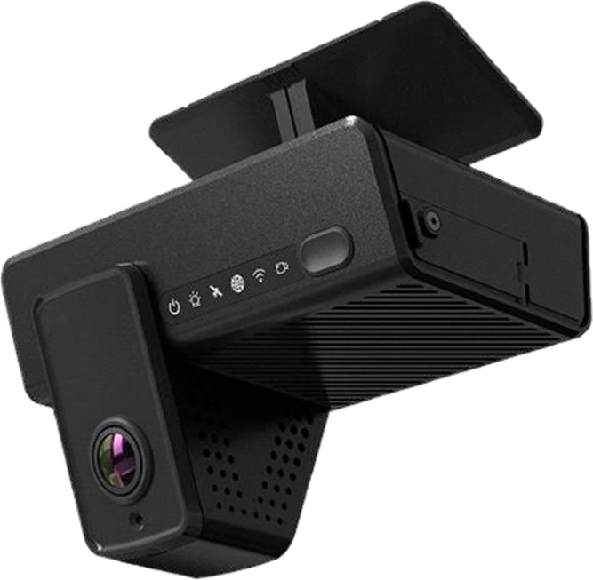
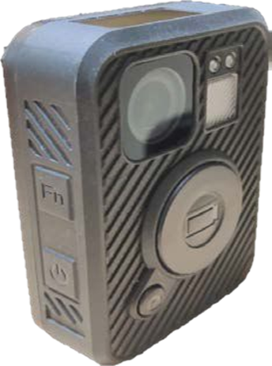

# Паспорта для регистраторов

## LA-AWD

**Мобильный видеорегистратор LA-AWD**

**Основные особенности:**

- **4 канала AHD (1080P)** и **1 канал IPC (1080P)**
- Поддерживает **две SD карты** объёмом до **512 Гб** каждая для записи
- Поддерживает **3G/4G, GPS, WiFi** (опционально)
- Удалённый запуск и **спящий режим** с низким энергопотреблением
- Формат сжатия **H.265** с восстановлением данных при экстренном отключении питания

**Функции активной безопасности:**

**LA-AWD(FW)** оснащен двумя пакетами алгоритмов ИИ:

1. **DMS (Driver Monitoring System)** – контроль состояния водителя
2. **ADAS (Advanced Driver Assistance Systems)** – система помощи водителю  
   _(возможна замена на **BSD – Blind Spot Detection**)_

При регистрации события система подаёт **звуковой и визуальный сигнал** через R-Watch. Записи событий могут выгружаться на сервер.

---

**Спецификация**

| Категория                     | Значение                                                                                                                                                                                                                                                                                                                                 |
| ----------------------------- | ---------------------------------------------------------------------------------------------------------------------------------------------------------------------------------------------------------------------------------------------------------------------------------------------------------------------------------------- |
| **Система**                   | Linux                                                                                                                                                                                                                                                                                                                                    |
|                               | CP4, мышь, EasyCheck, сеть (3G/4G/Wi-Fi)                                                                                                                                                                                                                                                                                                 |
| **Видео**                     | 4-канальный AHD + 1-канальный IPC                                                                                                                                                                                                                                                                                                        |
|                               | 1-канальный (CVBS)                                                                                                                                                                                                                                                                                                                       |
|                               | PAL/NTSC, IP                                                                                                                                                                                                                                                                                                                             |
|                               | 1080p, 720p                                                                                                                                                                                                                                                                                                                              |
|                               | До 30                                                                                                                                                                                                                                                                                                                                    |
|                               | Размах напряжения: 1В; Сопротивление: 75 Ом NTSC/PAL (опционально)                                                                                                                                                                                                                                                                       |
| **Аудио**                     | 4 аналоговых и 1 цифровой                                                                                                                                                                                                                                                                                                                |
|                               | 1 канал                                                                                                                                                                                                                                                                                                                                  |
|                               | Размах напряжения: 2В; Входное сопротивление: 4,7 кОм                                                                                                                                                                                                                                                                                    |
| **Дисплей**                   | 1/4/9-канальный дисплей                                                                                                                                                                                                                                                                                                                  |
|                               | Информация о местоположении, сигналы тревоги, номерные знаки, скорость движения, время и т.д.                                                                                                                                                                                                                                            |
|                               | Графический интерфейс пользователя                                                                                                                                                                                                                                                                                                       |
| **Запись**                    | H.264/H.265                                                                                                                                                                                                                                                                                                                              |
|                               | ADPCM, G.711U                                                                                                                                                                                                                                                                                                                            |
|                               | **Аналоговый:** PAL: 1080P (1920×1080), 720P (1280×720), WD1(928×576), WHD1(928×288), WCIF(464×288), D1(704×576), HD1(704×288), CIF(352×288) **NTSC:** 1080P (1920×1080), 720P (1280×720), WD1(928×480), WHD1(928×240), WCIF(464×240), D1(704×480), HD1(704×240), CIF(352×240) **Цифровой:** 1080P (1920×1080), 720P (1280×720) |
|                               | По дате, времени, каналу или событию                                                                                                                                                                                                                                                                                                     |
|                               | 2 слота для SD-карт объёмом до 512 Гб                                                                                                                                                                                                                                                                                                    |
| **Сеть**                      | 6-контактный авиационный разъём                                                                                                                                                                                                                                                                                                          |
|                               | LTE FDD: B1/B3/B7/B8/B20/B28A WCDMA: B1/B8 GSM: B3/B8 WiFi: 802.11a/b/g/n/ac                                                                                                                                                                                                                                                    |
|                               | Позиционирование, определение скорости, синхронизация времени GPS L1 1575.42 МГц BDS B1 1561.098 МГц ГАЛИЛЕО E1B/C1 ГЛОНАСС L1OF 1602 МГц                                                                                                                                                                                    |
|                               | Встроенный 6-осевой инерциальный G-сенсор                                                                                                                                                                                                                                                                                                |
| **Электропитание**            | 8–36 В постоянного тока                                                                                                                                                                                                                                                                                                                  |
|                               | 5 В, 500 мА                                                                                                                                                                                                                                                                                                                              |
|                               | 29 Вт                                                                                                                                                                                                                                                                                                                                    |
|                               | ≈ 0 Вт                                                                                                                                                                                                                                                                                                                                   |
| **Физические характеристики** | 0.83 кг                                                                                                                                                                                                                                                                                                                                  |
|                               | -40°C ~ +70°C                                                                                                                                                                                                                                                                                                                            |
|                               | 167.3 × 146.3 × 54.1 мм                                                                                                                                                                                                                                                                                                                  |

---

**Схема подключения:**

**Скачать паспорт** [LA-AWD.pdf](passports\files\LA-AWD.pdf ":ignore")

---

## LA-AMRH04/1

**Мобильный видеорегистратор LA-AMRH04/1**

**Основные особенности:**

- **Кодирование H.264/H.265** для оптимизации памяти
- **2,5" HDD** до 2 Тб с подогревом и защитой от отключения питания
- Антивибрационный корпус, простая установка
- Поддержка **3G/4G, GPS**

**Функции активной безопасности:**

- **DMS** (контроль состояния водителя)
- **ADAS** (система помощи водителю)
- **BSD** (контроль слепых зон)
- Оповещение через **R-Watch** (звук+визуал)

---

**Спецификация**

| Категория                | Значение                                                                                  |
| ------------------------ | ----------------------------------------------------------------------------------------- |
| **Система**              | Linux                                                                                     |
|                          | CP4, мышь, EasyCheck, сеть (3G/4G)                                                        |
| **Видео**                | 4-канальный AHD + 1-канальный IPC                                                         |
|                          | 1-канальный (CVBS)                                                                        |
|                          | PAL/NTSC, IP                                                                              |
|                          | 1080p, 720p                                                                               |
|                          | До 30 fps                                                                                 |
| **Аудио**                | 4 аналоговых + 1 цифровой                                                                 |
|                          | 1 канал                                                                                   |
| **Дисплей**              | 1/4/9-канальный                                                                           |
|                          | Координаты, тревоги, скорость, время                                                      |
| **Запись**               | H.264/H.265 (видео), ADPCM/G.711U (аудио)                                                 |
|                          | **Аналоговый:** PAL: 1080P-352×288 NTSC: 1080P-352×240 **Цифровой:** 1080P, 720P |
| **Сеть**                 | 6-контактный авиаразъём                                                                   |
|                          | LTE B1/B3/B7/B8/B20/B28A, WCDMA B1/B8, GSM B3/B8                                          |
|                          | L1 1575.42 МГц, ГЛОНАСС 1602 МГц                                                          |
| **Электропитание**       | 8–36 В                                                                                    |
|                          | 35 Вт (макс.), 0.7 Вт (ожидание)                                                          |
| **Физические параметры** | 1.2 кг                                                                                    |
|                          | -40°C ~ +70°C                                                                             |
|                          | 206×190×70.5 мм                                                                           |

---

**Схема подключения**

**Скачать паспорт** [LA-AMRH04.pdf](passports/files/LA-AMRH04.pdf ":ignore")

---

## LA-AMRH04/4

**Мобильный видеорегистратор LA-AMRH04/4**

**Основные особенности:**

- **4 AHD + 4 IP канала** с разрешением до 1920×1080 @ 30 к/с
- **2,5" HDD/SSD** до 2 Тб с подогревом и защитой питания
- Дополнительное хранилище на **SD-карте** до 256 Гб
- Антивибрационный корпус с простым монтажом
- Поддержка **3G/4G/Wi-Fi** и **GPS/ГЛОНАСС**

**Функции активной безопасности:**

- **DMS** (контроль состояния водителя)
- **ADAS** (ассистент водителя)
- **BSD** (мониторинг слепых зон)
- Оповещение через **R-Watch** (звук + свет)

---

| Категория                           | Характеристика                                                                                                                                                                                                                                                                                                             |
| ----------------------------------- | -------------------------------------------------------------------------------------------------------------------------------------------------------------------------------------------------------------------------------------------------------------------------------------------------------------------------- |
| **Система**                         |                                                                                                                                                                                                                                                                                                                            |
| Операционная система                | Linux                                                                                                                                                                                                                                                                                                                      |
| Управление                          | CP4, мышь, EasyCheck, сеть (3G/4G/Wi-Fi)                                                                                                                                                                                                                                                                                   |
| **Видео**                           |                                                                                                                                                                                                                                                                                                                            |
| Ввод                                | 4-канальный AHD + 4-канальный IPC                                                                                                                                                                                                                                                                                          |
| Вывод                               | 2-канальный (CVBS + VGA)                                                                                                                                                                                                                                                                                                   |
| Стандарты видеосигнала              | PAL/NTSC, IP                                                                                                                                                                                                                                                                                                               |
| Разрешения                          | 1080p, 720p                                                                                                                                                                                                                                                                                                                |
| Количество кадров в секунду         | До 30                                                                                                                                                                                                                                                                                                                      |
| Размах напряжения                   | 1В; Сопротивление: 75 Ом NTSC/PAL (опционально)                                                                                                                                                                                                                                                                            |
| **Аудио**                           |                                                                                                                                                                                                                                                                                                                            |
| Ввод                                | 4 аналоговых и 4 цифровых                                                                                                                                                                                                                                                                                                  |
| Выход                               | 1 канал                                                                                                                                                                                                                                                                                                                    |
| Размах напряжения                   | 2В; Входное сопротивление: 4,7 кОм                                                                                                                                                                                                                                                                                         |
| **Дисплей**                         |                                                                                                                                                                                                                                                                                                                            |
| Тип                                 | 1/4/9-канальный                                                                                                                                                                                                                                                                                                            |
| Отображение на экране               | Информация о местоположении, сигналы тревоги, номерные знаки, скорость движения, время и т.д.                                                                                                                                                                                                                              |
| Интерфейс управления                | Графический интерфейс пользователя                                                                                                                                                                                                                                                                                         |
| **Запись**                          |                                                                                                                                                                                                                                                                                                                            |
| Формат сжатия видео                 | Н.264/Н.265                                                                                                                                                                                                                                                                                                                |
| Формат сжатия аудио                 | ADPCM, G.711U                                                                                                                                                                                                                                                                                                              |
| Разрешения изображения              | Аналоговый: PAL: 1080P (1920X1080), 720P (1280X720), WD1(928X576), WHD1(928X288), WCIF(464X288), D1(704X576), HD1 (704x288), CIF (352x288); NTSC: 1080P (1920X1080), 720P (1280X720), WD1(928X480), WHD1(928X240), WCIF(464X240), D1(704x480), HD1 (704x240), CIF (352x240); Цифровой: 1080P (1920X1080), 720P (1280X720); |
| Режим поиска                        | По дате, времени, каналу или событию                                                                                                                                                                                                                                                                                       |
| **Сеть**                            |                                                                                                                                                                                                                                                                                                                            |
| IPC Ethernet                        | RJ25 (8P8C) 10/100 Мб                                                                                                                                                                                                                                                                                                      |
| 3G/4G                               | LTE FDD: B1/ B3 / B7 / B8 / B20 / B28A; WCDMA: B1/B8; GSM: B3/B8                                                                                                                                                                                                                                                           |
| GPS                                 | Позиционирование, определение скорости, синхронизация времени; GPS L1 1575.42 МГц; BDS B1 1561.098 МГц; ГАЛИЛЕО E1B/C1; ГЛОНАСС L1OF 1602 МГц                                                                                                                                                                              |
| WiFi (Опционально)                  | 802.11a/b/g/n/ac в режимах 2.4 и 5 ГГц                                                                                                                                                                                                                                                                                     |
| Акселерометр                        | Встроенный 6-осевой инерциальный G-сенсор                                                                                                                                                                                                                                                                                  |
| **Память**                          |                                                                                                                                                                                                                                                                                                                            |
| HDD/SSD                             | 2.5’’ SATA HDD или SSD                                                                                                                                                                                                                                                                                                     |
| Подогрев жёсткого диска             | Поддерживается                                                                                                                                                                                                                                                                                                             |
| SD                                  | 32-256 Гб SDXC                                                                                                                                                                                                                                                                                                             |
| **Порты**                           |                                                                                                                                                                                                                                                                                                                            |
| USB                                 | 1 USB2.0 (Type A) и 1 USB2.0 (Type B)                                                                                                                                                                                                                                                                                      |
| SD                                  | 1 слот                                                                                                                                                                                                                                                                                                                     |
| SIM                                 | 1 слот                                                                                                                                                                                                                                                                                                                     |
| Последовательные порты              | 2 RS232, 2 RS485 (1 для R-Watch)                                                                                                                                                                                                                                                                                           |
| CAN                                 | 1 слот                                                                                                                                                                                                                                                                                                                     |
| Ввод/вывод                          | 8-канальный ввод и 2-канальный вывод                                                                                                                                                                                                                                                                                       |
| Импульс скорости                    | 1-канальный                                                                                                                                                                                                                                                                                                                |
| Панель управления                   | CP4/CP5                                                                                                                                                                                                                                                                                                                    |
| Интерком                            | 1 микрофонный порт CP4                                                                                                                                                                                                                                                                                                     |
| **Электропитание**                  |                                                                                                                                                                                                                                                                                                                            |
| Вход                                | 8 – 36 В постоянного тока                                                                                                                                                                                                                                                                                                  |
| Выход                               | 5 В, 500 мА и 12 В, 500 мА                                                                                                                                                                                                                                                                                                 |
| Максимальное энергопотребление      | 50 Вт                                                                                                                                                                                                                                                                                                                      |
| Энергопотребление в режиме ожидания | ≈ 0 Вт                                                                                                                                                                                                                                                                                                                     |
| **Физические характеристики**       |                                                                                                                                                                                                                                                                                                                            |
| Вес                                 | 2.4 кг                                                                                                                                                                                                                                                                                                                     |
| Рабочая температура                 | -40°C ~ +70°C                                                                                                                                                                                                                                                                                                              |
| Размеры                             | 281 × 167 × 93 мм                                                                                                                                                                                                                                                                                                          |

**Схема подключения**

**Скачать паспорт** [LA-AMRH04-4.pdf](passports/files/LA-AMRH04-4.pdf ":ignore")

---

## LA-AMRH08/4

**Мобильный видеорегистратор LA-AMRH 8/4 (F)**

**Основные особенности:**

- **8 AHD + 4 IP каналов** с разрешением до 1920×1080 @ 30 к/с
- **2,5" HDD/SSD** до 2 Тб с подогревом и защитой питания
- Дополнительное хранилище на **SD-карте** до 256 Гб
- Антивибрационный корпус с простым монтажом
- Поддержка **3G/4G** и **GPS/ГЛОНАСС/BeiDou/Галилео**
- Встроенные **ИИ-функции для AHD-камер**

**Функции активной безопасности:**

- **DMS** (контроль состояния водителя)
- **ADAS** (ассистент водителя)
- **BSD** (мониторинг слепых зон)
- Оповещение через **R-Watch** (звук + свет)
- Зеркальная запись для резервирования данных

---

| Категория                | Характеристика                                                               |
| ------------------------ | ---------------------------------------------------------------------------- |
| **Система**              |                                                                              |
| Операционная система     | Linux 4.9                                                                    |
| Управление               | CP4, мышь, EasyCheck, сеть (3G/4G)                                           |
| **Видео**                |                                                                              |
| Ввод                     | 8-канальный AHD + 4-канальный IPC                                            |
| Вывод                    | 1-канальный CVBS + 1-канальный VGA                                           |
| Стандарты видеосигнала   | PAL/NTSC, IP                                                                 |
| Разрешения               | 1080p, 720p                                                                  |
| Частота кадров           | До 30 к/с                                                                    |
| **Аудио**                |                                                                              |
| Ввод                     | 8 аналоговых + 4 цифровых                                                    |
| Выход                    | 2 канала                                                                     |
| **Дисплей**              |                                                                              |
| Тип                      | 1/4/9-канальный                                                              |
| Интерфейс                | Графический GUI с отображением скорости, координат, тревог и номерных знаков |
| **Запись**               |                                                                              |
| Форматы сжатия           | H.265/H.264 (видео), ADPCM/G.711U/A (аудио)                                  |
| Режимы записи            | Ручная/По расписанию/По событию/Аварийная                                    |
| Предзапись тревоги       | До 60 минут                                                                  |
| **Память**               |                                                                              |
| Встроенная               | 2.5" SATA HDD/SSD (до 2 Тб) с подогревом                                     |
| Резервная                | SDXC до 256 Гб                                                               |
| **Сеть**                 |                                                                              |
| Ethernet                 | Gigabit RJ45 (10/100/1000 Мбит/с)                                            |
| Мобильная связь          | LTE/WCDMA/GSM (мультидиапазонный)                                            |
| Навигация                | GPS/ГЛОНАСС/BeiDou/Галилео с синхронизацией времени                          |
| **Интерфейсы**           |                                                                              |
| Порты                    | 2×USB 2.0, 2×RS232, 3×RS485, VGA, 8DI/2DO                                    |
| Слоты                    | 1×SD, 1×SIM                                                                  |
| **Электропитание**       |                                                                              |
| Вход                     | 8-36 В DC                                                                    |
| Потребление              | До 70 Вт (режим ожидания ≈0 Вт)                                              |
| **Физические параметры** |                                                                              |
| Размеры                  | 295×222×89 мм (с креплениями)                                                |
| Вес                      | 3.2 кг (без HDD)                                                             |
| Температурный режим      | -40°C...+70°C                                                                |

**Схема подключения**

**Скачать паспорт** [LA-AMRH8-4(F).pdf](<passports/files/LA-AMRH08-4(F).pdf> ":ignore")

---

## Прочие

### LA-AMRH02-2

**Мобильный видеорегистратор LA-AMRH02/2**

**Основные особенности:**

- **2 AHD + 2 IP канала** с разрешением до 1920×1080 @ 30 к/с
- Поддержка **двух SD-карт** объёмом до 512 Гб каждая
- Поддержка **3G/4G**, **GPS/ГЛОНАСС**, **Wi-Fi** и **Bluetooth** (опция)
- Формат сжатия **H.264/H.265**, специализированная файловая система для защиты данных при аварийном отключении
- **Встроенный стабилизатор и накопитель энергии**: до 60 минут автономной записи при критически низком напряжении
- Настройка уровня напряжения для автоматического отключения
- **Круглосуточный режим работы (24/7)**
- Металлический влагозащищённый и антивибрационный корпус
- Рабочий диапазон температур: от -40°C до +70°C

**Функции активной безопасности:**

- **DMS** (контроль состояния водителя)
- **ADAS** (ассистент водителя) с возможностью замены на **BSD** (мониторинг слепых зон)
- Оповещение через **R-Watch** (звук + свет)
- Выгрузка событий на сервер в зависимости от настроек

---

| Категория                | Характеристика                                                             |
| ------------------------ | -------------------------------------------------------------------------- |
| **Система**              |                                                                            |
| Операционная система     | Linux                                                                      |
| Управление               | Пульт ДУ, главная панель, сеть (3G/4G/Wi-Fi)                               |
| **Видео**                |                                                                            |
| Ввод                     | 2-канальный AHD + 2-канальный IPC                                          |
| Вывод                    | 1-канальный                                                                |
| Стандарты видеосигнала   | PAL/NTSC, IP                                                               |
| Разрешения               | 1080p, 720p                                                                |
| Частота кадров           | До 30 к/с                                                                  |
| **Аудио**                |                                                                            |
| Ввод                     | 2 аналоговых + 2 цифровых                                                  |
| Выход                    | 1 канал                                                                    |
| **Дисплей**              |                                                                            |
| Тип                      | 1/4/9-канальный                                                            |
| Интерфейс                | Графический GUI с отображением координат, тревог, номеров, скорости и т.д. |
| **Запись**               |                                                                            |
| Форматы сжатия           | H.265/H.264 (видео), ADPCM/G.711U (аудио)                                  |
| Разрешения (аналог)      | PAL/NTSC: 1080P, 720P, WD1, WHD1, WCIF, D1, HD1, CIF                       |
| Разрешения (цифра)       | 1080P, 720P                                                                |
| Режимы поиска            | По дате, времени, каналу или событию                                       |
| **Память**               |                                                                            |
| Встроенная               | 2 слота для SD-карт до 512 Гб каждая                                       |
| **Сеть**                 |                                                                            |
| Ethernet                 | 6-контактный авиационный разъём                                            |
| Мобильная связь          | LTE FDD: B1/B3/B7/B8/B20/B28A; WCDMA: B1/B8; GSM: B3/B8                    |
| Wi-Fi                    | 802.11 a/b/g/n/ac                                                          |
| Навигация                | GPS, ГЛОНАСС, Galileo, BeiDou с синхронизацией времени                     |
| **Интерфейсы**           |                                                                            |
| Акселерометр             | Встроенный 6-осевой инерциальный G-сенсор                                  |
| **Камеры**               |                                                                            |
| Камера на дорогу         | 5 Мп CMOS, угол обзора 170°, 1920×1080                                     |
| Доп. камера              | 2 Мп CMOS, угол обзора 120°, 1920×1080                                     |
| **Электропитание**       |                                                                            |
| Вход                     | 8–36 В DC                                                                  |
| Выход                    | 12 В / 2 A; 5 В / 2 A                                                      |
| Потребление              | До 105 Вт                                                                  |
| **Физические параметры** |                                                                            |
| Размеры                  | 113 × 106 × 68 мм                                                          |
| Вес                      | 0.75 кг                                                                    |
| Температурный режим      | -40°C...+70°C                                                              |

**Скачать паспорт** [LA-AMRH02-2.pdf](passports/files/LA-AMRH02-2.pdf ":ignore")

---

### LA-BR5

**Носимый видеорегистратор LA-BR5**

**Основные особенности:**

- **Матрица с разрешением HD**
- **4 входных интерфейса**
- **Металлический корпус** с универсальной подставкой
- **Встроенный динамик** для общения с водителем

---

| Категория                    | Характеристика                      |
| ---------------------------- | ----------------------------------- |
| **Видео**                    |                                     |
| Разрешение                   | 1440P / 1296P / 1080P / 720P / 480P |
| Частота кадров               | До 30 к/с                           |
| Видеокодек                   | H.264 / H.265                       |
| Режим экспозиции             | Автоматический                      |
| **Аудио**                    |                                     |
| Формат                       | WAV, ACC                            |
| Устройства                   | Встроенные микрофон и динамик       |
| **Память**                   |                                     |
| Поддержка SD-карт            | До 128 ГБ                           |
| **Интерфейсы**               |                                     |
| Подключение                  | Mini USB                            |
| Входные интерфейсы           | 4 входа                             |
| **Электропитание**           |                                     |
| Тип аккумулятора             | 3.7 В, 2800 мА·ч                    |
| Время работы                 | До 15 часов от одного заряда        |
| **Физические параметры**     |                                     |
| Габариты                     | 83 × 54 × 27 мм (Д × Ш × В)         |
| Вес                          | 153 г                               |
| **Эксплуатационные условия** |                                     |
| Температурный режим          | от -30°C до +60°C                   |
| Класс защиты                 | IP66                                |

**Скачать паспорт** [LA-BR5.pdf](passports/files/LA-BR5.pdf ":ignore")
