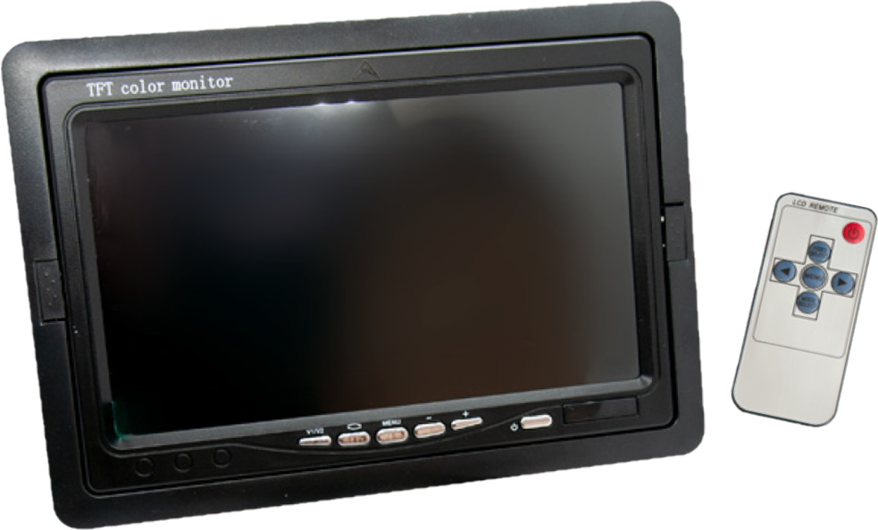
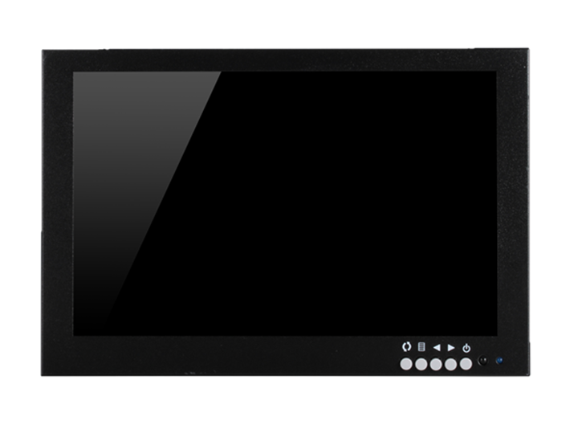
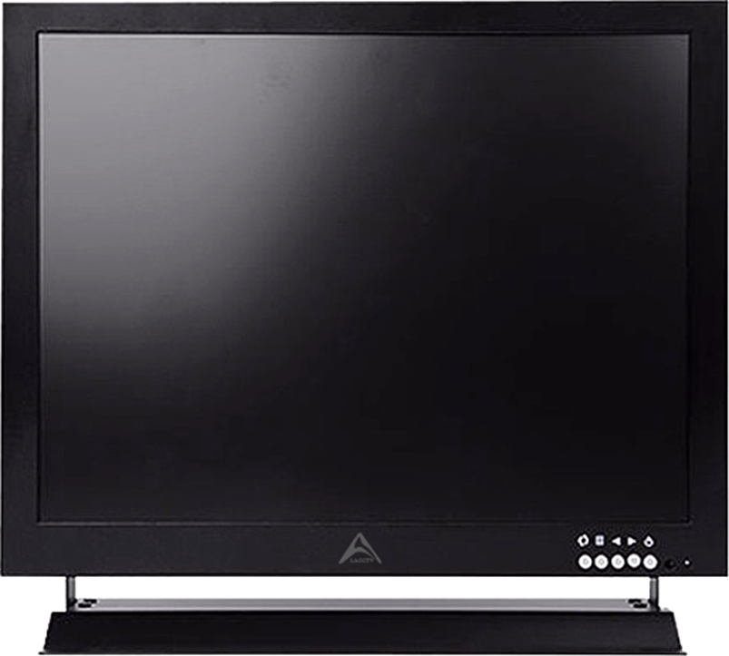

# Паспорта оборудования для мониторов

## Компактные (для автотранспорта)

### LA-LCD7-A

**Монитор LA-LCD7-A**

**Основные особенности:**

- **Автомобильный монитор бюджетного класса с IPS матрицей**
- **Разрешение изображения 856x480 точек**
- **Размер экрана 7 дюймов**
- **Возможность подключения к штатному мультимедийному комплексу**
- **Расширенный диапазон рабочих температур от -20°C до +60°C**
- **Встроенные динамики**

---

| **Категория**                   | **Характеристика**      |
| ------------------------------- | ----------------------- |
| **Размер**                      | 7’’                     |
| **Соотношение сторон**          | 16:9, 4:3               |
| **Разрешение**                  | 856x480                 |
| **Тип развёртки**               | PAL/NTSC (авто)         |
| **Тип матрицы**                 | IPS                     |
| **Тип экрана**                  | TFT, цветной, сенсорный |
| **Количество видеовходов**      | 2                       |
| **Подключение к регистратору**  | 4 pin                   |
| **Зеркалирование**              | Есть                    |
| **Настройки языка меню**        | Есть                    |
| **Настройки контрастности**     | Есть                    |
| **Настройки насыщенности**      | Есть                    |
| **Поддержка внешних динамиков** | Да                      |
| **Встроенные динамики**         | Да                      |
| **Рабочая температура**         | от -20°C до +60°C       |
| **Электропитание**              | 12 В                    |

**Скачать паспорт** [LA-LCD7-A.pdf](passports/files/LA-LCD7-A.pdf ":ignore")

### LA-LCD7-N

**Монитор LA-LCD7-N**

**Основные особенности:**

- **Автомобильный монитор бюджетного класса с IPS матрицей**
- **Разрешение изображения 856x480 точек**
- **Размер экрана 7 дюймов**
- **Возможность подключения к штатному мультимедийному комплексу**
- **Расширенный диапазон рабочих температур от -20°C до +60°C**

---

| **Категория**                   | **Характеристика**      |
| ------------------------------- | ----------------------- |
| **Размер**                      | 7’’                     |
| **Соотношение сторон**          | 16:9, 4:3               |
| **Разрешение**                  | 856x480                 |
| **Тип развёртки**               | PAL/NTSC (авто)         |
| **Тип матрицы**                 | IPS                     |
| **Тип экрана**                  | TFT, цветной, сенсорный |
| **Количество видеовходов**      | 2                       |
| **Подключение к регистратору**  | 4 pin                   |
| **Зеркалирование**              | Есть                    |
| **Настройки языка меню**        | Есть                    |
| **Настройки контрастности**     | Есть                    |
| **Настройки насыщенности**      | Есть                    |
| **Поддержка внешних динамиков** | Да                      |
| **Встроенные динамики**         | Нет                     |
| **Рабочая температура**         | от -20°C до +60°C       |
| **Электропитание**              | 12 В                    |

**Скачать паспорт** [LA-LCD7-N.pdf](passports/files/LA-LCD7-N.pdf ":ignore")

### LA-10LCD

**Монитор для транспорта LA-10LCD**

**Основные особенности:**

- **Металлический корпус**
- **Поддержка VGA, HDMI, BNC, USB, AV**
- **Совместим со всей линейкой регистраторов**
- **Пульт дистанционного управления (ИК)**

---

| **Категория**          | **Характеристика**      |
| ---------------------- | ----------------------- |
| **Размер**             | 10’’                    |
| **Разрешение**         | 1024x600                |
| **Соотношение сторон** | 16:10                   |
| **Яркость**            | 450 кд/м²               |
| **Контрастность**      | 600:1                   |
| **Время отклика**      | ≤ 5 мс                  |
| **Материал корпуса**   | Металл                  |
| **Источники сигналов** | VGA, HDMI, BNC, USB, AV |
| **Пульт ДУ**           | Инфракрасный            |
| **Электропитание**     | 12 В                    |

**Скачать паспорт** [LA-10LCD.pdf](passports/files/LA-10LCD.pdf ":ignore")

## Большие (для ЖД)

### LA-17LCD

**Монитор для транспорта LA-17LCD**

**Основные особенности:**

- **Матрица с разрешением HD**
- **4 входных интерфейса: BNC, HDMI, VGA, RCA**
- **Металлический корпус с универсальной подставкой**
- **Встроенный динамик для общения с водителем**

---

| **Категория**               | **Характеристика**                                           |
| --------------------------- | ------------------------------------------------------------ |
| **Размер**                  | 17’’                                                         |
| **Разрешение**              | 1280x1024                                                    |
| **Соотношение сторон**      | 4:3                                                          |
| **Материал корпуса**        | Металл                                                       |
| **ЖК панель**               | TFT матрица                                                  |
| **Контрастность**           | 1000:1                                                       |
| **Яркость**                 | 450 кд/м²                                                    |
| **Время отклика**           | 5 мс                                                         |
| **Видеовходы**              | BNC, HDMI, VGA, RCA                                          |
| **Аудио вход/выход**        | Mini Jack 3.5 мм                                             |
| **Угол обзора**             | 178°                                                         |
| **OSD**                     | Мультиязычное                                                |
| **Регулировки OSD**         | Яркость, контрастность, цвет, звук                           |
| **Время наработки**         | 50 000 часов                                                 |
| **Крепёжная разметка VESA** | 100x100 мм                                                   |
| **Электропитание**          | DC 12 В                                                      |
| **Потребляемая мощность**   | До 30 Вт                                                     |
| **Размеры (без подставки)** | 400 x 340 x 20 мм                                            |
| **Рабочая температура**     | от -20°C до +40°C                                            |
| **Комплектация**            | Крепёжная подставка 3D Axis, пульт дистанционного управления |

**Скачать паспорт** [LA-17LCD.pdf](passports/files/LA-17LCD.pdf ":ignore")
